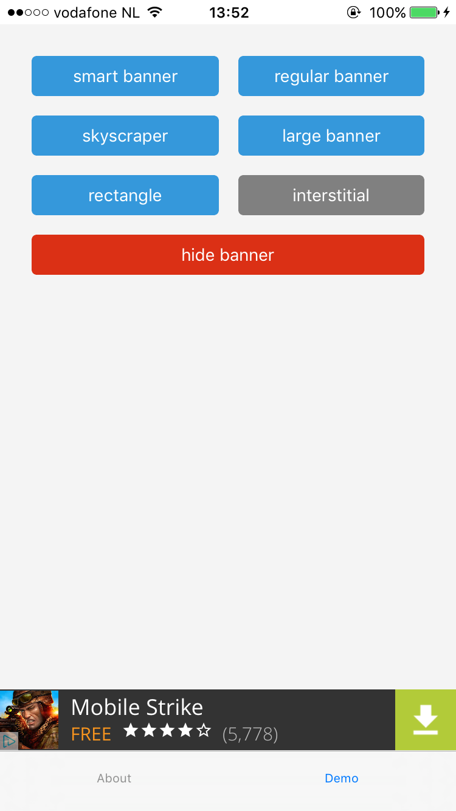
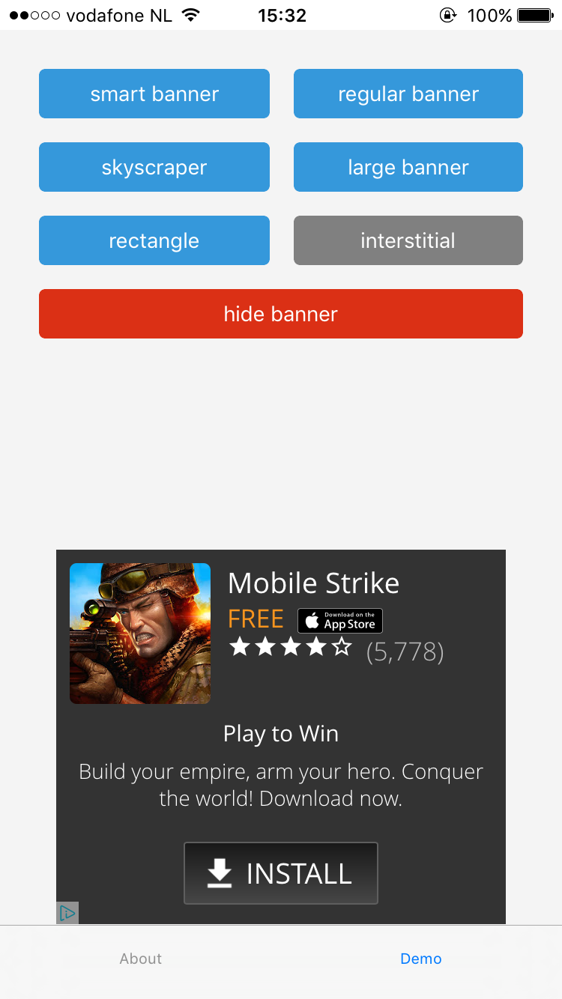
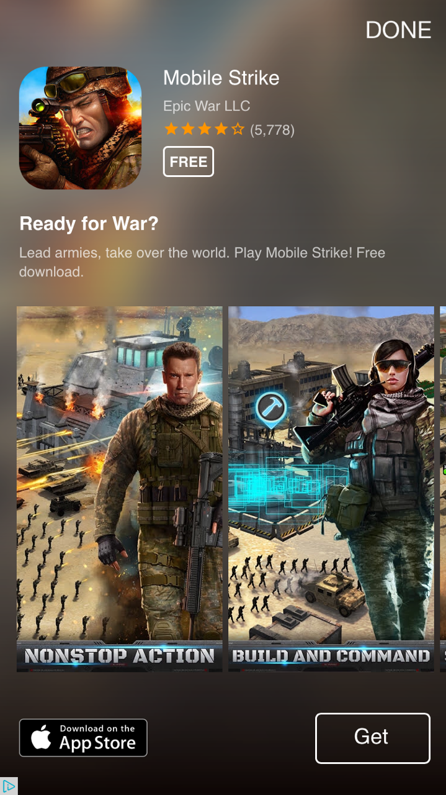

# nativescript-admob demo app

Demo app for the {N} [admob plugin](https://www.npmjs.com/package/nativescript-admob)

## Installation

This app is built with the [NativeScript CLI](https://github.com/NativeScript/nativescript-cli).
Once you have the [CLI installed](https://github.com/NativeScript/nativescript-cli#installation), start by cloning the repo:

```
$ git clone https://github.com/EddyVerbruggen/nativescript-admob-demo
$ cd nativescript-admob-demo
$ cd AdMob
```

Next, install the app's iOS and Android runtimes, as well as the app's npm dependencies:

```
$ tns install
```

From there you can use the `run` command to run the demo app on iOS:

```
$ tns run ios --emulator
```

.. or on Android

```
$ tns run android --emulator
```

## Screenshots (iOS)









Not trying to promote that game btw :)
